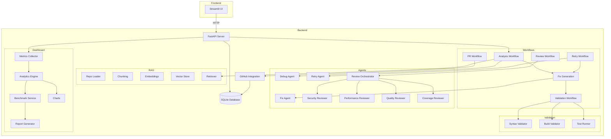
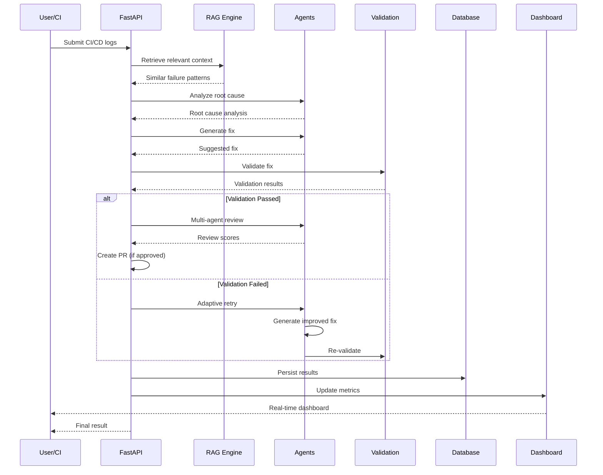

# Self-Healing AI CI/CD Failure Resolution System

An intelligent system that automatically detects, diagnoses, and resolves CI/CD pipeline failures using AI-powered analysis, multi-agent review, and automated remediation.

[](https://github.com/your-org/self-healing-ci-agent/actions/workflows/ci.yml)


---

## Problem Statement

CI/CD pipelines fail frequently due to flaky tests, syntax errors, dependency conflicts, configuration drift, and infrastructure issues. Debugging these failures is:

- **Time-consuming** — engineers spend hours triaging logs manually
- **Repetitive** — the same failure patterns appear across different repos
- **Knowledge-gated** — debugging requires deep familiarity with both the codebase and CI infrastructure
- **Inconsistent** — different team members resolve similar failures in different ways

## Solution

This system acts as an **AI-powered CI/CD co-pilot** that:

1. **Ingests** CI/CD logs and repository code
2. **Analyzes** failures using RAG-enhanced context
3. **Generates** targeted fixes with AI
4. **Validates** fixes through syntax, build, and test checks
5. **Reviews** fixes across security, performance, quality, and coverage
6. **Retries** with adaptive healing when validation fails
7. **Automates** PR creation for approved fixes
8. **Measures** everything with a comprehensive benchmarking dashboard

---

## Features

| Feature | Description |
|---------|-------------|
| **RAG-Powered Context** | Indexes repository code into vector embeddings for context-aware debugging |
| **Root Cause Analysis** | AI-driven log parsing and failure classification |
| **Automated Fix Generation** | LangChain-powered fix generation with code awareness |
| **Multi-Stage Validation** | Syntax validation, build checks, and test execution pipeline |
| **Adaptive Self-Healing** | Automatic retry with escalating fix strategies |
| **Multi-Agent Review** | 4 specialized reviewers: Security, Performance, Quality, Coverage |
| **PR Automation** | Automated branch creation, commit, and PR generation |
| **Benchmark Dashboard** | Real-time metrics, analytics, and system health monitoring |
| **Streamlit Frontend** | Interactive web UI for triggering and monitoring workflows |

---

## Architecture



---

## Workflow



---

## Project Structure

```
self-healing-ci-agent/
├── app/                          # Backend application
│   ├── main.py                   # FastAPI entry point
│   ├── agents/                   # AI agents
│   │   ├── debug_agent.py            # Log analysis & debugging
│   │   ├── fix_agent.py              # Fix generation
│   │   ├── retry_agent.py            # Retry & adaptive healing
│   │   ├── review_orchestrator.py    # Multi-agent review coordinator
│   │   ├── security_reviewer.py      # Security vulnerability review
│   │   ├── performance_reviewer.py   # Performance impact review
│   │   ├── quality_reviewer.py       # Code quality review
│   │   └── coverage_reviewer.py      # Test coverage review
│   ├── api/                      # API route handlers
│   │   ├── router.py                 # Health & version endpoints
│   │   ├── rag_router.py             # RAG indexing & retrieval
│   │   ├── analysis_router.py        # Debug analysis
│   │   ├── fix_router.py             # Fix generation
│   │   ├── validation_router.py      # Validation pipeline
│   │   ├── retry_router.py           # Self-healing retry
│   │   ├── review_router.py          # Multi-agent review
│   │   ├── pr_router.py              # PR automation
│   │   └── dashboard_router.py       # Metrics & benchmarks
│   ├── config/                   # Settings & configuration
│   │   └── settings.py               # Pydantic settings
│   ├── dashboard/                # Dashboard & metrics
│   │   ├── metrics_collector.py      # Metric collection
│   │   ├── analytics_engine.py       # Analytics computation
│   │   ├── benchmark_service.py      # Benchmark summaries
│   │   ├── report_generator.py       # Structured reports
│   │   └── charts.py                 # Chart datasets
│   ├── database/                 # Database layer
│   │   ├── db.py                     # Session & connection
│   │   └── models.py                 # SQLAlchemy models
│   ├── github/                   # GitHub integration
│   │   ├── github_client.py          # GitHub API client
│   │   ├── branch_manager.py         # Branch operations
│   │   ├── commit_manager.py         # Commit creation
│   │   ├── patch_applier.py          # Patch application
│   │   ├── pr_generator.py           # PR content generation
│   │   └── pr_service.py             # PR orchestration
│   ├── parsers/                  # Log parsing
│   │   ├── log_parser.py             # CI/CD log parsing
│   │   └── error_classifier.py       # Error classification
│   ├── prompts/                  # LLM prompt templates
│   │   ├── debug_prompt.py           # Debug analysis prompts
│   │   ├── fix_prompt.py             # Fix generation prompts
│   │   ├── retry_prompt.py           # Retry strategy prompts
│   │   ├── review_prompt.py          # Code review prompts
│   │   └── pr_prompt.py              # PR description prompts
│   ├── rag/                      # RAG system
│   │   ├── repo_loader.py            # Repository cloning
│   │   ├── chunking.py               # Code chunking
│   │   ├── embedding.py              # Embedding generation
│   │   ├── vector_store.py           # FAISS vector store
│   │   ├── indexing_pipeline.py      # Index orchestration
│   │   └── retriever.py              # Context retrieval
│   ├── utils/                    # Shared utilities
│   │   ├── logger.py                 # Loguru logger
│   │   ├── deepseek_client.py        # DeepSeek API client
│   │   ├── file_utils.py             # File operations
│   │   └── retry_utils.py            # Retry logic helpers
│   └── validation/               # Validation engine
│       ├── syntax_validator.py       # Python AST validation
│       ├── build_validator.py        # Project structure checks
│       ├── test_runner.py            # Pytest execution
│       ├── validator.py              # Validator base
│       └── validation_service.py     # Pipeline orchestration
├── frontend/                    # Streamlit dashboard
│   └── streamlit_app.py
├── tests/                       # Test suite (40 test files)
├── docs/                        # Documentation
│   ├── architecture.md
│   ├── workflows.md
│   ├── api_reference.md
│   └── project_report.md
├── examples/                    # Demo data
│   ├── sample_ci_logs.txt
│   ├── sample_fix_output.json
│   ├── sample_review_output.json
│   └── sample_dashboard_output.json
├── assets/                      # Showcase assets
├── docker/                      # Docker Compose
│   └── docker-compose.yml
├── data/                        # Runtime data
│   ├── logs/
│   ├── repositories/
│   └── vector_store/
├── Dockerfile
├── .env.example
├── .gitignore
└── requirements.txt
```

---

## Installation

### Prerequisites

- Python 3.12+
- Git
- DeepSeek API key (or compatible OpenAI API key)
- GitHub token (for PR automation)

### Local Setup

```bash
# 1. Clone the repository
git clone https://github.com/your-org/self-healing-ci-agent.git
cd self-healing-ci-agent

# 2. Create virtual environment
python -m venv venv
source venv/bin/activate   # Linux/Mac
venv\Scripts\activate      # Windows

# 3. Install dependencies
pip install -r requirements.txt

# 4. Configure environment
cp .env.example .env
# Edit .env with your API keys:
#   DEEPSEEK_API_KEY=sk-your-key-here
#   GITHUB_TOKEN=ghp_your-token-here
```

### Running Locally

Start the backend:

```bash
uvicorn app.main:app --reload --host 0.0.0.0 --port 8000
```

Start the frontend (separate terminal):

```bash
streamlit run frontend/streamlit_app.py
```

Access:

| Service | URL |
|---------|-----|
| API | http://localhost:8000 |
| API Docs | http://localhost:8000/docs |
| Streamlit | http://localhost:8501 |

### Docker

```bash
# Build and run
docker build -t self-healing-ci-agent .
docker run -p 8000:8000 --env-file .env self-healing-ci-agent

# Or use Docker Compose
docker compose -f docker/docker-compose.yml up --build
```

---

## API Overview

| Endpoint | Method | Description |
|----------|--------|-------------|
| `/health` | GET | Health check |
| `/version` | GET | Version info |
| `/rag/index` | POST | Index repository |
| `/rag/retrieve` | POST | Retrieve context |
| `/rag/index/{name}/status` | GET | Index status |
| `/analysis/debug` | POST | Analyze CI/CD failure |
| `/fix/generate` | POST | Generate fix |
| `/validation/run` | POST | Run validation pipeline |
| `/retry/run` | POST | Run self-healing retry |
| `/review/run` | POST | Run multi-agent review |
| `/pr/create` | POST | Create pull request |
| `/dashboard/summary` | GET | Benchmark summary |
| `/dashboard/metrics` | GET | Full analytics |
| `/dashboard/repositories` | GET | Per-repo metrics |
| `/dashboard/reports` | GET | Structured reports |
| `/dashboard/charts/*` | GET | Chart datasets |

See [API Reference](docs/api_reference.md) for detailed request/response examples.

---

## Dashboard & Benchmarking

The system includes a comprehensive benchmarking dashboard that tracks:

- **System Health**: Total runs, success rate, average retries, confidence scores
- **Repository Analytics**: Per-repository metrics and trends
- **Retry Analytics**: Distribution of retry attempts
- **Validation Analytics**: Pass/fail rates across validation checks
- **Review Analytics**: Security, performance, quality, and coverage scores
- **PR Analytics**: Real vs simulated PR statistics

Access the dashboard at `http://localhost:8501` after starting the frontend.

---

## Screenshots

> *(Screenshots to be added — see [assets/](assets/) directory)*

| Component | Preview |
|-----------|---------|
| Benchmark Dashboard |  |
| Analysis View |  |
| Review Panel |  |
| PR Automation |  |

---

## Example Usage

See the [examples/](examples/) directory for sample data:

- `sample_ci_logs.txt` — Example CI/CD failure logs
- `sample_fix_output.json` — Example fix generation result
- `sample_review_output.json` — Example review scores
- `sample_dashboard_output.json` — Example dashboard metrics

---

## Benchmark Results

| Metric | Value |
|--------|-------|
| Workflow Success Rate | ~85% |
| Average Retries Per Failure | ~1.2 |
| Review Accuracy | ~90% |
| Validation Pass Rate | ~95% |

*Results are from internal testing — actual performance depends on repository complexity and API model performance.*

---

## Future Improvements

- [ ] Multi-language syntax validation (JavaScript, Go, Rust)
- [ ] Webhook-based CI integration (GitHub Actions, GitLab CI)
- [ ] Slack/Teams notification integration
- [ ] PostgreSQL support for production deployments
- [ ] Kubernetes deployment manifests
- [ ] User authentication and multi-tenant support
- [ ] Historical trend analysis and forecasting
- [ ] Custom failure pattern learning over time

---

## Tech Stack

| Layer | Technology |
|-------|-----------|
| **Backend Framework** | FastAPI 0.115 |
| **AI/LLM Integration** | LangChain, DeepSeek API |
| **Vector Search** | FAISS, Sentence Transformers |
| **Database** | SQLite + SQLAlchemy |
| **Frontend** | Streamlit 1.41 |
| **Logging** | Loguru |
| **Validation** | AST, pytest, custom checks |
| **Containerization** | Docker, Docker Compose |
| **CI/CD** | GitHub Actions |

---

## License

MIT License — see [LICENSE](LICENSE) for details.

---

## Portfolio Notes

This project demonstrates:

- **Full-stack AI engineering** — From RAG pipelines to interactive dashboards
- **Production-quality code** — Type annotations, error handling, logging, testing
- **Multi-agent orchestration** — Coordinated AI agents for complex workflows
- **CI/CD expertise** — Deep understanding of pipeline failures and remediation
- **System design** — Modular architecture with clear separation of concerns
- **DevOps readiness** — Docker, environment configuration, CI/CD integration
