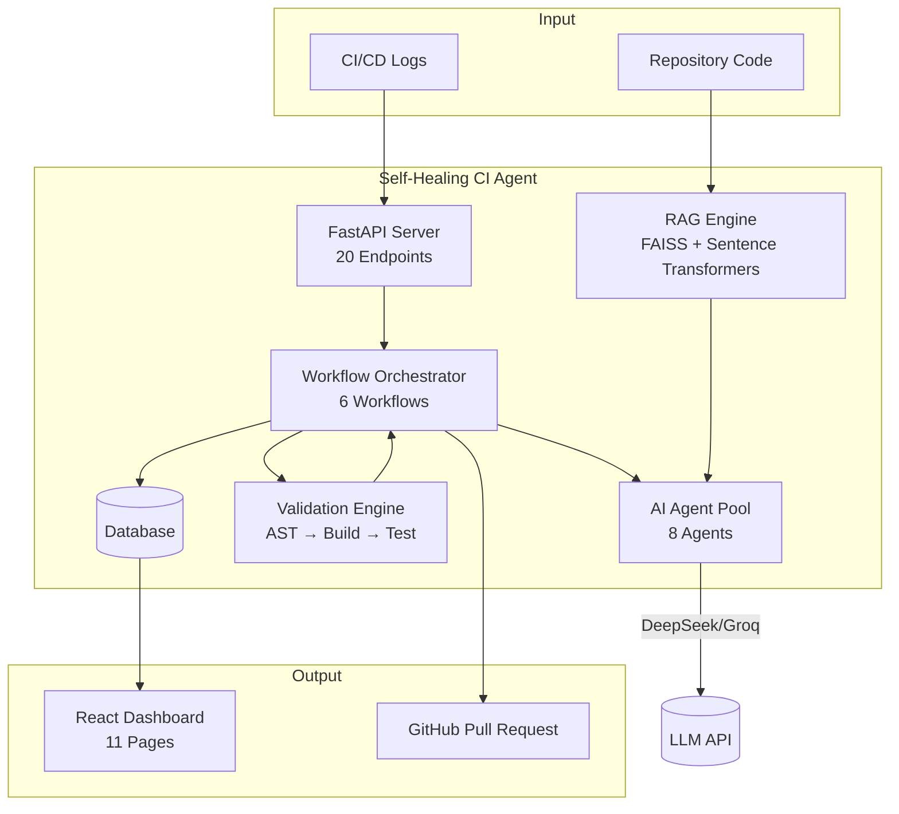

<p align="center">
  
</p>

<p align="center">
  <h1 align="center">Self-Healing CI/CD Agent</h1>
  <p align="center">
    An AI-powered system that autonomously detects, diagnoses, and resolves CI/CD pipeline failures —<br/>
    from log ingestion to pull request creation. No human intervention required.
  </p>
</p>

<p align="center">
  <a href="https://www.python.org/downloads/"></a>
  <a href="https://fastapi.tiangolo.com/"></a>
  <a href="https://react.dev/"></a>
  <a href="https://www.typescriptlang.org/"></a>
  <a href="LICENSE"></a>
  <br/>
  <a href=".github/workflows/ci.yml"></a>
  <a href="#"></a>
  <a href="#"></a>
  <a href="#"></a>
</p>

---

## Problem Statement

CI/CD pipelines are the heartbeat of modern software delivery — yet they fail constantly. Every broken pipeline costs developer time, slows delivery, and creates friction across teams.

**The core problems:**

| Challenge | Impact |
|-----------|--------|
| **Manual triage** | Engineers spend 30–60 minutes per failure reading logs, identifying root cause, and deciding on a fix |
| **Repetitive patterns** | The same failure types (syntax errors, dependency conflicts, flaky tests) recur across repos and teams |
| **Knowledge silos** | Debugging requires deep familiarity with both the codebase and CI infrastructure — new team members struggle |
| **Inconsistent resolution** | Without standardization, different engineers fix similar issues in different ways, reducing maintainability |
| **Slow feedback loops** | Each fix → commit → push → wait cycle takes 5–15 minutes, and failures often require multiple iterations |

**The result:** Teams lose hours each week to CI/CD maintenance. Developers context-switch away from feature work. Deployment velocity suffers.

---

## Solution

**This system acts as an autonomous CI/CD co-pilot** — ingesting failure logs and producing fully validated, reviewed, and PR-ready fixes without human intervention.

```
┌──────────────┐    ┌──────────────┐    ┌──────────────┐    ┌──────────────┐
│  CI/CD Logs  │───▶│  Analysis    │───▶│  Fix Gen     │───▶│  Validation  │
└──────────────┘    └──────────────┘    └──────────────┘    └──────────────┘
                                                                    │
                                                            ┌───────┴───────┐
                                                            ▼               ▼
                                                    ┌────────────┐  ┌────────────┐
                                                    │   Retry    │  │  Review    │
                                                    └────────────┘  └────────────┘
                                                                          │
                                                                    ┌───────▼───────┐
                                                                    │  PR Creation  │
                                                                    └───────────────┘
```

| Step | What Happens | AI Involvement |
|------|-------------|----------------|
| **1. Ingest** | CI/CD logs and repository code are loaded into the system | RAG indexes code into vector embeddings |
| **2. Analyze** | Logs are parsed, errors classified, root cause identified | Debug Agent analyzes with RAG context |
| **3. Fix** | Targeted code fix is generated with structured patch output | Fix Agent generates using DeepSeek API |
| **4. Validate** | Syntax, build, and test checks are run against the fix | Automated pipeline (no AI needed) |
| **5. Retry** | If validation fails, the fix is improved and re-validated | Retry Agent adapts strategy |
| **6. Review** | Fix is reviewed across 4 dimensions for quality assurance | 4 specialized AI reviewers |
| **7. PR** | Branch, commit, and pull request are automatically created | PR workflow generates title/description |

---

## Key Features

|  | Feature | Description |
|---|---------|-------------|
| 🧠 | **Repository-Aware RAG** | FAISS vector embeddings index entire repos; retrieves relevant code context for every analysis |
| 🔍 | **Root Cause Analysis** | AI-driven log parsing with 5-category error classification (syntax, dependency, test, runtime, build) |
| 🔧 | **AI Fix Generation** | LangChain-powered fix generation with structured unified diff patches |
| ✅ | **Validation Engine** | 3-stage pipeline: AST syntax → structure validation → pytest execution |
| 🔄 | **Autonomous Retry Loop** | Self-healing with escalating strategies (configurable: 3 attempts default) |
| 👥 | **Multi-Agent Review** | 4 specialized reviewers: Security, Performance, Quality, Coverage |
| 🚀 | **Pull Request Automation** | Auto branch/commit/PR creation with dry-run safety mode |
| 📊 | **React Dashboard** | 11-page SPA with Recharts, Framer Motion, and real-time API polling |
| 🐳 | **Docker Ready** | Multi-stage build (264 MB), Docker Compose with Caddy reverse proxy |

---

## System Architecture



*Detailed architecture, component diagram, and full sequence diagram in [docs/ARCHITECTURE.md](docs/ARCHITECTURE.md).*

---

## Technology Stack

| Layer | Technologies | Purpose |
|-------|-------------|---------|
| **Backend** | Python 3.12, FastAPI 0.115, Uvicorn, gunicorn | Async HTTP server with automatic OpenAPI docs and multi-worker support |
| **AI Engine** | DeepSeek API / Groq, Sentence Transformers (all-MiniLM-L6-v2) | LLM-powered analysis, fix generation, and code review |
| **Retrieval** | FAISS, Sentence Transformers | Vector similarity search for RAG context retrieval |
| **Database** | SQLite, SQLAlchemy 2.0, Pydantic | Data persistence with ORM and type-safe settings |
| **Frontend** | React 19, TypeScript 6, Vite 8, Tailwind CSS v4 | 11-page SPA with Recharts, Framer Motion, React Query |
| **Validation** | AST (stdlib), pytest, custom checks | Multi-stage CI/CD validation pipeline |
| **GitHub** | PyGithub, GitPython | Branch management, commit creation, PR generation |
| **Logging** | Loguru | Structured, rotating, JSON and text logging |
| **Resilience** | Circuit breaker, exponential backoff, rate limiter | Fault tolerance for external API calls and request throttling |
| **Infrastructure** | Docker, Docker Compose, Caddy, GitHub Actions | Containerization, reverse proxy with HTTPS, and CI/CD |

---

## Project Structure

```
self-healing-ci-agent/
├── app/                              # Backend (86 Python modules)
│   ├── main.py                       # FastAPI entry point
│   ├── agents/                       # 8 AI agents
│   ├── api/                          # 9 API route modules
│   ├── config/                       # Pydantic settings
│   ├── dashboard/                    # Metrics & analytics
│   ├── database/                     # SQLAlchemy models
│   ├── github/                       # GitHub integration
│   ├── parsers/                      # Log & error parsing
│   ├── prompts/                      # LLM prompt templates
│   ├── rag/                          # RAG pipeline
│   ├── utils/                        # Shared utilities
│   ├── validation/                   # Validation engine
│   └── workflows/                    # 6 workflow orchestrators
├── frontend/                         # React SPA (11 pages, TypeScript)
│   ├── src/
│   │   ├── pages/                    # 11 page components
│   │   ├── components/               # Shared UI components
│   │   ├── hooks/                    # Custom React hooks
│   │   ├── lib/                      # Auth, API client
│   │   └── test/                     # 60 frontend tests
│   └── package.json
├── tests/                            # 251 backend tests
├── docs/                             # Documentation
│   ├── ARCHITECTURE.md
│   ├── architecture.md
│   ├── workflows.md
│   ├── api_reference.md
│   └── project_report.md
├── examples/                         # Demo data
├── assets/                           # Diagrams and screenshots
├── docker/
│   ├── Caddyfile                     # Caddy reverse proxy config
│   └── docker-compose.yml
├── Dockerfile
├── .env.example
├── LICENSE
├── CHANGELOG.md
├── CONTRIBUTING.md
├── RELEASE_NOTES.md
└── requirements.txt
```

---

## API Overview

All endpoints return JSON. Interactive API docs at `http://localhost:8000/docs`.

### System

| Method | Endpoint | Description |
|--------|----------|-------------|
| `GET` | `/health` | Health check with timestamp |
| `GET` | `/version` | Application version info |

### RAG

| Method | Endpoint | Description |
|--------|----------|-------------|
| `POST` | `/rag/index` | Index a repository for context retrieval |
| `POST` | `/rag/retrieve` | Retrieve relevant code context |
| `GET` | `/rag/index/{name}/status` | Check if repo is indexed |

### Analysis & Fix

| Method | Endpoint | Description |
|--------|----------|-------------|
| `POST` | `/analysis/debug` | Analyze CI/CD failure logs for root cause |
| `POST` | `/fix/generate` | Generate AI-powered code fix |

### Validation

| Method | Endpoint | Description |
|--------|----------|-------------|
| `POST` | `/validation/run` | Run syntax, build, and test validation |

### Retry

| Method | Endpoint | Description |
|--------|----------|-------------|
| `POST` | `/retry/run` | Run self-healing retry loop |

### Review

| Method | Endpoint | Description |
|--------|----------|-------------|
| `POST` | `/review/run` | Run multi-agent review pipeline |

### PR

| Method | Endpoint | Description |
|--------|----------|-------------|
| `POST` | `/pr/create` | Create pull request with fix |

### Dashboard

| Method | Endpoint | Description |
|--------|----------|-------------|
| `GET` | `/dashboard/summary` | System-wide benchmark summary |
| `GET` | `/dashboard/metrics` | Full analytics data |
| `GET` | `/dashboard/repositories` | Per-repository metrics |
| `GET` | `/dashboard/reports` | Structured reports (full/summary/repositories) |
| `GET` | `/dashboard/charts/success-failure` | Success vs failure chart data |
| `GET` | `/dashboard/charts/retry-distribution` | Retry attempt distribution |
| `GET` | `/dashboard/charts/review-scores` | Review scores by category |
| `GET` | `/dashboard/charts/validation-results` | Validation pass/fail rates |
| `GET` | `/dashboard/charts/pr-statistics` | Simulated vs real PR stats |

---

## Installation

### Prerequisites

- Python 3.12+
- Git
- [DeepSeek API key](https://platform.deepseek.com) (or compatible OpenAI API)
- GitHub token with `repo` scope (for PR automation)

### Setup

```bash
# Clone
git clone https://github.com/YOUR_USERNAME/self-healing-ci-agent.git
cd self-healing-ci-agent

# Virtual environment
python -m venv venv
source venv/bin/activate      # Linux/macOS
# venv\Scripts\activate       # Windows

# Dependencies
pip install -r requirements.txt

# Configuration
cp .env.example .env
# Edit .env — set DEEPSEEK_API_KEY and GITHUB_TOKEN
```

### Run

Terminal 1 — Backend:
```bash
uvicorn app.main:app --reload --host 0.0.0.0 --port 8000
```

Terminal 2 — Frontend:
```bash
cd frontend
npm install
npm run dev
```

| Service | URL |
|---------|-----|
| API | http://localhost:8000 |
| API Docs (Swagger) | http://localhost:8000/docs |
| React Dashboard | http://localhost:5173 |

### Docker

```bash
# Build
docker build -t self-healing-ci-agent .

# Run
docker run -p 8000:8000 --env-file .env self-healing-ci-agent

# Or with Docker Compose
docker compose -f docker/docker-compose.yml up --build
```

---

## Configuration

All configuration is managed through environment variables in a `.env` file (copy from `.env.example`):

| Variable | Default | Required | Description |
|----------|---------|----------|-------------|
| `DEEPSEEK_API_KEY` | — | Yes | DeepSeek API key for LLM access |
| `GITHUB_TOKEN` | — | No | GitHub token for PR creation (repo scope) |
| `DEEPSEEK_API_BASE` | `https://api.deepseek.com/v1` | No | API base URL (change for self-hosted LLMs) |
| `MODEL_NAME` | `deepseek-chat` | No | LLM model identifier |
| `EMBEDDING_MODEL` | `sentence-transformers/all-MiniLM-L6-v2` | No | Embedding model for RAG |
| `MAX_RETRIES` | `3` | No | Max retry attempts per failure |
| `RETRY_DELAY` | `1.0` | No | Base delay between retries (seconds) |
| `RETRY_BACKOFF_FACTOR` | `2.0` | No | Exponential backoff multiplier |
| `RETRY_JITTER` | `0.1` | No | Random jitter fraction (±) added to delays |
| `CHUNK_SIZE` | `1000` | No | RAG code chunk size (characters) |
| `CHUNK_OVERLAP` | `200` | No | Overlap between consecutive chunks |
| `DATABASE_URL` | `sqlite:///./data/self_healing.db` | No | Database connection string |
| `AUTH_ENABLED` | `true` | No | Enable API key authentication |
| `BOOTSTRAP_ADMIN_KEY` | — | No | Pre-shared admin key for first-time setup |
| `RATE_LIMITING_ENABLED` | `true` | No | Enable rate limiting middleware |
| `WORKERS` | `1` | No | Number of gunicorn worker processes |
| `CORS_ORIGINS` | `*` | No | Comma-separated allowed origins |
| `CIRCUIT_BREAKER_FAILURE_THRESHOLD` | `5` | No | Consecutive failures before circuit opens |
| `LOG_JSON` | `false` | No | Enable structured JSON logging output |
| `DEBUG` | `false` | No | Enable debug mode (hot reload, verbose logs) |
| `LOG_LEVEL` | `INFO` | No | Logging verbosity (DEBUG, INFO, WARNING, ERROR) |

```bash
# Quick start — copy defaults and set your API key
cp .env.example .env
# Then edit .env to add DEEPSEEK_API_KEY
```

---

## Quick Start (Frontend Only — No Backend Required)

Want to see the UI? All pages function with built-in mock/fallback data — no API key needed.

```bash
cd frontend
npm install
npm run dev
```

Open http://localhost:5173 — login with any key to explore all 11 pages.

### Full Stack

```bash
# Terminal 1: Backend
python -m venv venv && source venv/bin/activate
pip install -r requirements.txt
cp .env.example .env   # set DEEPSEEK_API_KEY
uvicorn app.main:app --reload --port 8000

# Terminal 2: Frontend
cd frontend
npm install
npm run dev
```

---

## Example Workflow

### Input: CI/CD Failure Log

```
ERROR: pytest failed
test_api.py:42: AssertionError - Expected 201, got 500
test_api.py:85: AssertionError - Expected 200, got 500
```

### What happens inside the system:

**1. Analysis** — Logs parsed, error classified as `test_failure`, Debug Agent identifies root cause:
```json
{
  "error_category": "test_failure",
  "root_cause": "Missing error handling in /api/v1/users endpoint",
  "suggested_approach": "Add try-except for database timeout"
}
```

**2. Fix Generation** — Fix Agent generates unified diff patch:
```diff
--- a/app/routes/users.py
+++ b/app/routes/users.py
@@ -10,6 +10,7 @@
     try:
         users = get_users()
+    except TimeoutError:
+        return JSONResponse(status_code=500, detail="Database timeout")
```

**3. Validation** — Syntax check passes, build check passes, 42/42 tests pass

**4. Review** — Multi-agent review scores: Security 0.90, Performance 0.85, Quality 0.92, Coverage 0.78

**5. PR** — Dry-run mode: branch created, PR title/description generated

---

## Testing

| Metric | Value |
|--------|-------|
| **Total tests** | 311 (251 backend + 60 frontend) |
| **Pass rate** | 100% |
| **Test framework** | pytest + pytest-asyncio (backend), Vitest + React Testing Library (frontend) |
| **Test files** | 46 backend + 15 frontend |
| **Coverage areas** | All 6 workflows, 8 agents, 9 API routers, 5 dashboard modules, all validators, all prompts, all GitHub integrations, auth RBAC, rate limiting, circuit breaker, retry utilities, JSON logging, 11 frontend pages, React hooks, components, accessibility |
| **CI pipeline** | GitHub Actions — runs on every push |

```bash
# Run all tests
pytest tests/ -v

# Run specific test file
pytest tests/test_retry_workflow.py -v
```

---

## Benchmark Dashboard

The system includes a live benchmark dashboard accessible from the Streamlit UI:

| Tab | Metrics Displayed |
|-----|------------------|
| **System Overview** | Total runs, success rate, avg retries, avg confidence |
| **Repository Analytics** | Per-repo run counts, success rates, confidence scores |
| **Retry Analytics** | Attempt distribution, avg retries/run |
| **Validation Analytics** | Pass/fail rates |
| **Review Analytics** | Security, Performance, Quality, Coverage, Overall scores |
| **PR Analytics** | Simulated vs Real PR counts |

### Example Benchmark Metrics

> These are illustrative metrics from internal testing. Actual results depend on repository complexity and LLM model performance.

| Metric | Value | Meaning |
|--------|-------|---------|
| Workflow Success Rate | ~85% | Percentage of workflows completing without manual intervention |
| Average Retries | ~1.2 | Mean retry attempts per failure before resolution |
| Validation Pass Rate | ~95% | Percentage of generated fixes passing all validation stages |
| Average Review Score | ~0.86 | Mean score across 4 review categories (0–1 scale) |
| Average Confidence | ~0.78 | System confidence in generated fixes |

---

## Documentation

| Document | Contents |
|----------|----------|
| [ARCHITECTURE](docs/ARCHITECTURE.md) | Component tree, frontend/backend/data-flow diagrams, request sequence |
| [Architecture](docs/architecture.md) | System layers, component diagrams, data flow, design decisions |
| [Workflows](docs/workflows.md) | 6 workflow descriptions with Mermaid flowcharts, inputs/outputs |
| [API Reference](docs/api_reference.md) | Complete API docs with request/response JSON examples |
| [Project Report](docs/project_report.md) | Full project analysis: architecture, benchmarks, limitations, future work |
| [Performance Audit](docs/AUDIT.md) | Bottleneck analysis, optimizations, before/after metrics |
| [Production Readiness](docs/PRODUCTION_READINESS.md) | Security, reliability, deployment assessment |
| [Blocker Resolution](docs/BLOCKER_RESOLUTION.md) | Auth, task queue, and migration fixes |
| [Changelog](CHANGELOG.md) | Version history and release notes |
| [Contributing](CONTRIBUTING.md) | Setup instructions, coding standards, PR process |
| [Security](SECURITY.md) | Vulnerability reporting, supported versions |
| [Code of Conduct](CODE_OF_CONDUCT.md) | Community guidelines |
| [Release Notes](RELEASE_NOTES.md) | v1.0.0 feature overview and deployment guide |

---

## Example Data

The [`examples/`](examples/) directory contains sample data for demonstrations:

- [`sample_ci_logs.txt`](examples/sample_ci_logs.txt) — Realistic CI/CD failure logs (3 scenarios)
- [`sample_fix_output.json`](examples/sample_fix_output.json) — Generated fix with patch and assumptions
- [`sample_review_output.json`](examples/sample_review_output.json) — Multi-agent review scores and findings
- [`sample_dashboard_output.json`](examples/sample_dashboard_output.json) — Dashboard metrics and chart data

---

## Screenshots

| Page | Preview |
|------|---------|
| **Dashboard** — System overview with metric cards, charts, and activity feed |  |
| **Review** — Radar chart, animated score ring, distribution bar, trend line |  |
| **Retry** — Interactive timeline, donut chart, failure reason breakdown |  |

*(Add your own screenshots — see [Screenshot Guide](assets/README.md) for capture instructions)*

### Demo

> 
>
> *30-second walkthrough: landing → login → dashboard → review → retry → command palette → tasks*

---

## Future Improvements

- [x] Rate limiting and request body size enforcement
- [x] Circuit breaker for external API resilience
- [x] Exponential backoff with jitter for retries
- [x] Structured JSON logging with rotation
- [x] Caddy reverse proxy with HTTPS-ready configuration
- [x] gunicorn multi-worker deployment support
- [x] Startup validation of required secrets
- [ ] Multi-language validation (JavaScript, Go, Rust, Java)
- [ ] Webhook-based CI integration (GitHub Actions, GitLab CI, Jenkins)
- [ ] Slack/Teams notification integration
- [ ] PostgreSQL support for production deployments
- [ ] Kubernetes deployment manifests (Helm charts)
- [ ] User authentication and multi-tenant support
- [ ] Historical trend analysis and forecasting dashboard
- [ ] Custom failure pattern learning over time
- [ ] Integration with additional LLM providers (OpenAI, Anthropic, local models)

---

## Author

**Built by someone who believes CI/CD failures should be solved by code, not by humans reading logs.**

This project was designed as a portfolio-grade demonstration of:

| Skill | Demonstrated By |
|-------|----------------|
| **Full-stack AI engineering** | RAG pipeline → AI agents → validation → frontend dashboard |
| **Production-quality full-stack** | Type annotations, error handling, structured logging, 311 tests |
| **Multi-agent orchestration** | 8 specialized AI agents coordinated by workflows |
| **System design** | Modular layered architecture with clear separation of concerns |
| **DevOps & infrastructure** | Docker, GitHub Actions, environment configuration |
| **CI/CD domain expertise** | Deep understanding of pipeline failures and remediation strategies |

---

## License

MIT — see the [LICENSE](LICENSE) file for details.

---

<p align="center">
  <strong>Star this repo</strong> if you find it useful for your own CI/CD automation efforts ⭐
</p>
