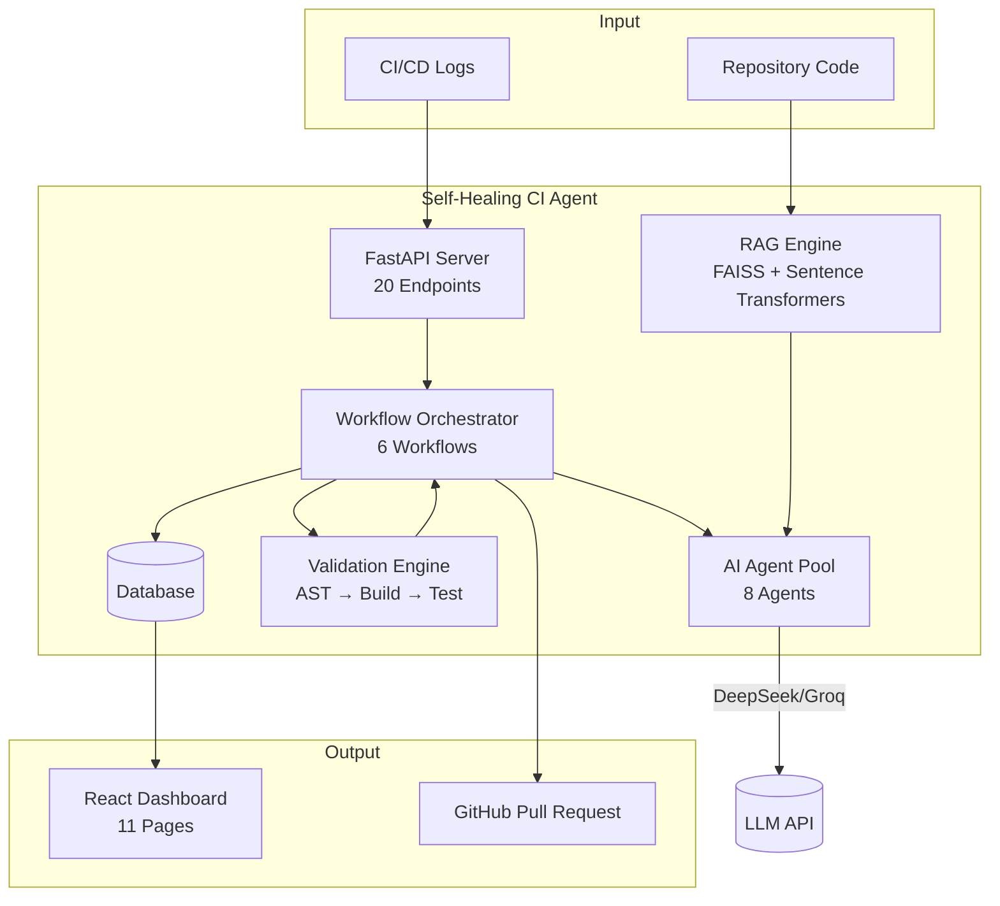
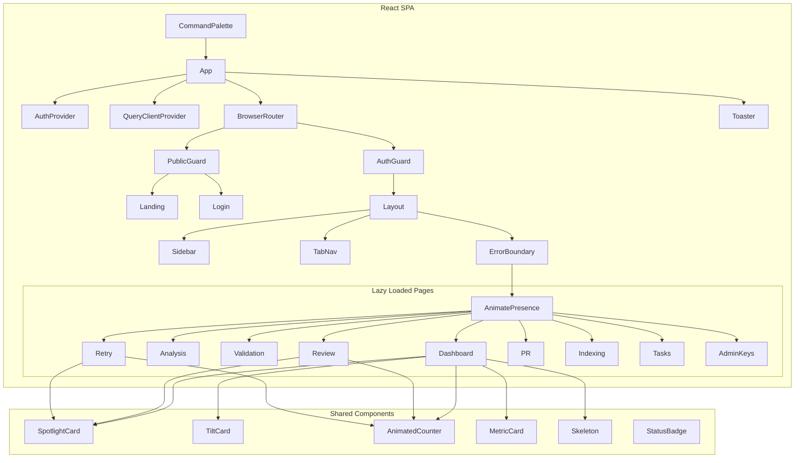
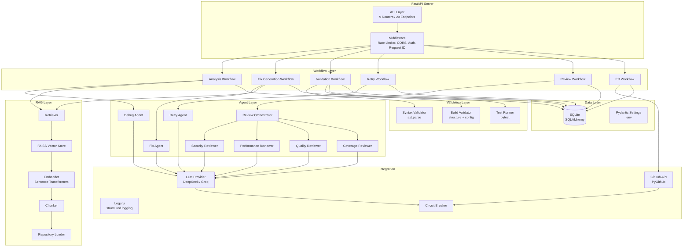
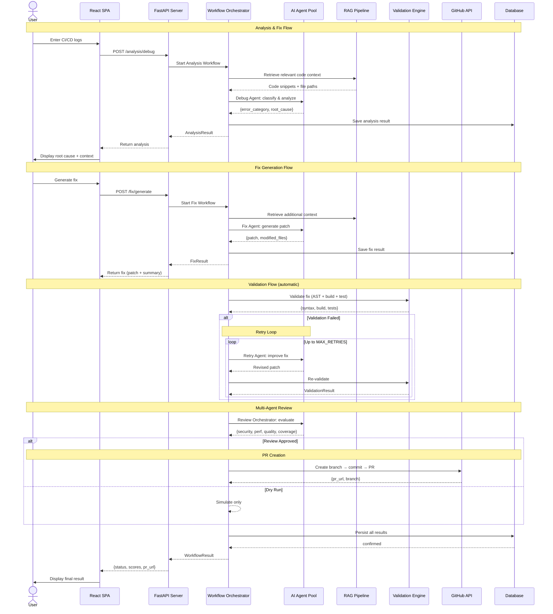
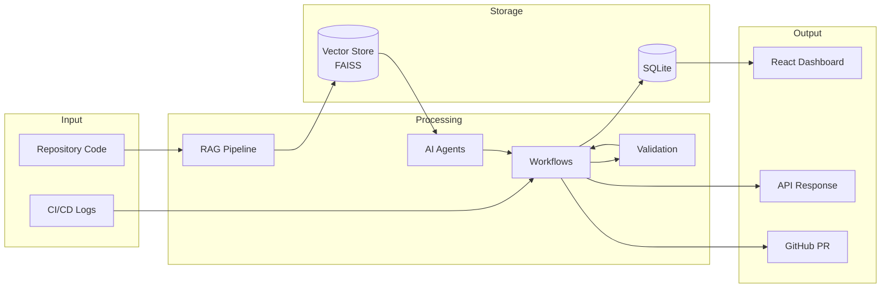
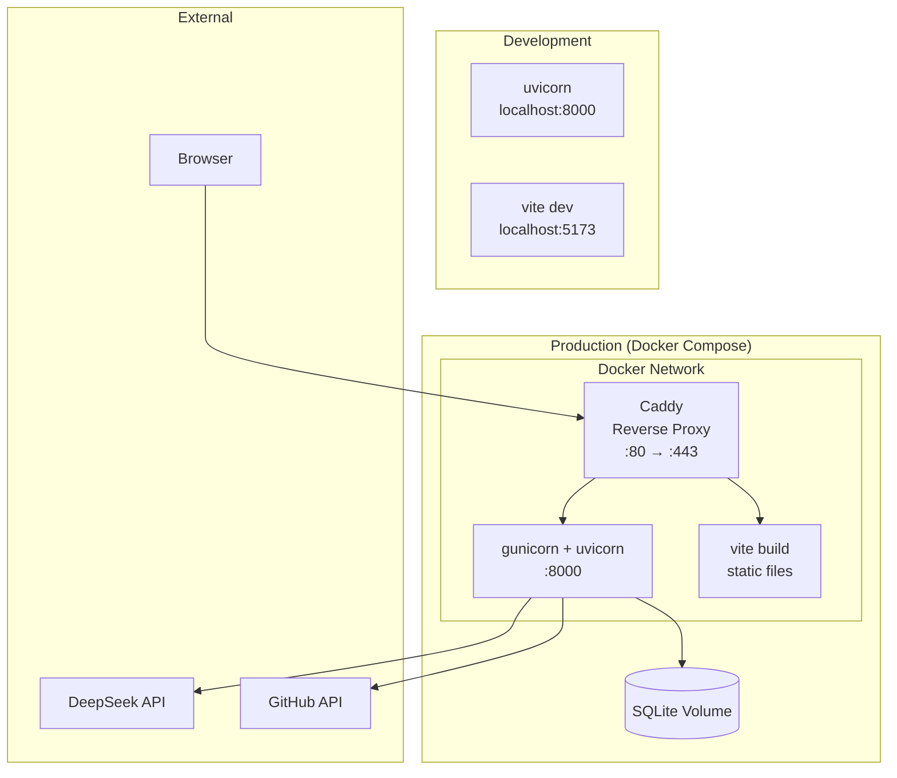
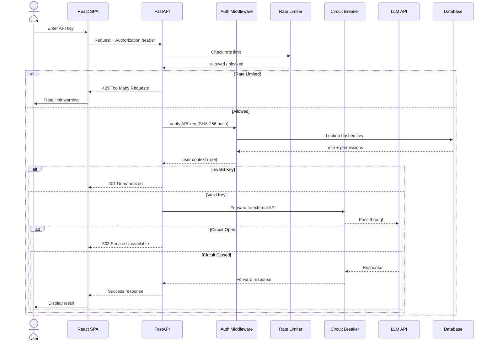

# Architecture

## 1. System Overview

The Self-Healing CI/CD Agent is built on a modular architecture using FastAPI as the core backend framework and React 19 for the frontend. The system is organized into distinct layers that handle specific responsibilities, from data ingestion to workflow orchestration to presentation.

### High-Level Block Diagram



---

## 2. Layer Architecture

### 2.1 API Layer (`app/api/`)

Entry points for all external interactions. Uses FastAPI routers with clear separation:

- **System Routes** — Health checks and versioning
- **RAG Routes** — Repository indexing and context retrieval
- **Analysis Routes** — CI/CD failure analysis
- **Fix Routes** — AI-powered fix generation
- **Validation Routes** — Multi-stage validation pipeline
- **Retry Routes** — Self-healing retry loop
- **Review Routes** — Multi-agent code review
- **PR Routes** — Pull request automation
- **Dashboard Routes** — Metrics, analytics, and benchmarks

All routes use Pydantic models for request validation and follow consistent error handling patterns.

### 2.2 Agent Layer (`app/agents/`)

8 specialized AI agents, each responsible for a specific task:

| Agent | Responsibility | Prompt Template |
|-------|---------------|-----------------|
| Debug Agent | Analyzes CI/CD logs to identify root cause | `debug_prompt.py` |
| Fix Agent | Generates code fixes using RAG context | `fix_prompt.py` |
| Retry Agent | Implements adaptive retry strategies | `retry_prompt.py` |
| Review Orchestrator | Coordinates multi-agent review | `review_prompt.py` |
| Security Reviewer | Scans for security vulnerabilities | `security_reviewer_prompt.py` |
| Performance Reviewer | Evaluates performance impact | `performance_reviewer_prompt.py` |
| Quality Reviewer | Assesses code quality | `quality_reviewer_prompt.py` |
| Coverage Reviewer | Checks test coverage adequacy | `coverage_reviewer_prompt.py` |

### 2.3 RAG Layer (`app/rag/`)

Retrieval-Augmented Generation pipeline for context-aware debugging:

- **Repository Loader** — Clones and loads repositories
- **Chunking** — Splits code into semantically meaningful chunks
- **Embedding** — Generates vector embeddings using Sentence Transformers
- **Vector Store** — FAISS-based vector index for similarity search
- **Retriever** — Queries the vector store for relevant context
- **Indexing Pipeline** — Orchestrates the full indexing workflow

### 2.4 Validation Layer (`app/validation/`)

Multi-stage validation pipeline:

- **Syntax Validator** — Validates Python syntax using `ast.parse`
- **Build Validator** — Checks project structure, config files, imports
- **Test Runner** — Executes pytest and captures failures
- **Validation Service** — Orchestrates the full validation pipeline

### 2.5 Workflow Layer (`app/workflows/`)

Orchestration layer that coordinates agents, RAG, validation, and persistence:

- **Analysis Workflow** — Coordinates debug analysis with RAG context
- **Fix Generation Workflow** — Generates and applies fixes
- **Validation Workflow** — Runs full validation pipeline
- **Retry Workflow** — Implements adaptive self-healing loop
- **Review Workflow** — Runs multi-agent review pipeline
- **PR Workflow** — Orchestrates PR creation

### 2.6 Frontend Layer (`frontend/src/`)

React 19 + TypeScript 6 SPA with 11 pages:

- **Public pages** — Landing, Login
- **Authenticated pages** — Dashboard, Analysis, Validation, Retry, Review, PR, Indexing, Tasks, Admin Keys
- **Shared components** — Layout, SpotlightCard, TiltCard, AnimatedCounter, MetricCard, Skeleton, StatusBadge
- **Data layer** — React Query (30s stale time), AuthProvider (sessionStorage)
- **Animation** — Framer Motion with AnimatePresence page transitions

---

## 3. Component Tree (React)



---

## 4. Frontend Architecture

```mermaid
graph LR
    subgraph "Routing (react-router-dom v7)"
        LA[lazy dashboard]
        LB[lazy analysis]
        LC[lazy validation]
        LD[lazy retry]
        LE[lazy review]
        LF[lazy pr]
        LG[lazy indexing]
        LH[lazy tasks]
        LI[lazy admin-keys]
    end

    subgraph "Data Layer"
        RQ[React Query<br/>staleTime: 30s]
        API[REST Client<br/>fetch()]
        Auth[AuthProvider<br/>sessionStorage]
    end

    subgraph "UI Layer"
        FM[Framer Motion<br/>spring animations]
        RC[Recharts<br/>8 chart types]
        TAIL[Tailwind CSS v4]
        LU[Lucide Icons]
    end

    subgraph "Pages (11)"
        LND[Landing]
        LGN[Login]
        DSH[Dashboard]
        ANL[Analysis]
        VAL[Validation]
        RTY[Retry]
        RVW[Review]
        PR[PR]
        IDX[Indexing]
        TSK[Tasks]
        ADM[Admin Keys]
    end

    LA --> DSH
    LB --> ANL
    LC --> VAL
    LD --> RTY
    LE --> RVW
    LF --> PR
    LG --> IDX
    LH --> TSK
    LI --> ADM

    DSH --> RQ
    ANL --> RQ
    VAL --> RQ
    RTY --> RQ
    RVW --> RQ
    PR --> RQ
    IDX --> RQ
    TSK --> RQ
    ADM --> Auth

    DSH --> RC
    RVW --> RC
    RTY --> RC

    DSH --> FM
    LND --> FM
    LVL --> FM
```

---

## 5. Backend Architecture



---

## 6. Request Flow

### End-to-End Sequence: Analysis → Fix → Validate → Retry → Review → PR



---

## 7. Data Flow



---

## 8. Deployment Architecture



---

## 9. Security Architecture



---

## 10. Technology Stack

| Component | Technology | Purpose |
|-----------|-----------|---------|
| **Web Framework** | FastAPI 0.115 | Async Python API server |
| **Web Server** | gunicorn + uvicorn | Multi-worker production deployment |
| **AI Framework** | LangChain 1.0 | LLM abstraction and agent chaining |
| **LLM Providers** | DeepSeek API, Groq | AI reasoning, analysis, and code generation |
| **Vector Search** | FAISS + Sentence Transformers | Semantic code search for RAG context |
| **Database** | SQLite + SQLAlchemy | Data persistence |
| **Frontend** | React 19 + TypeScript 6 | 11-page SPA dashboard |
| **Build Tool** | Vite 8 | Fast dev server and optimized builds |
| **Styling** | Tailwind CSS v4 | Utility-first CSS framework |
| **Charts** | Recharts 3.8 | Interactive data visualizations |
| **Animation** | Framer Motion 12 | Spring animations, page transitions |
| **Icons** | Lucide React | Consistent icon set |
| **Data Fetching** | TanStack React Query 5 | Server state management and caching |
| **Auth** | sessionStorage + SHA-256 | Secure token storage |
| **Logging** | Loguru | Structured rotating logs |
| **Container** | Docker + Docker Compose + Caddy | Deployment packaging and reverse proxy |
| **CI/CD** | GitHub Actions | Automated linting, testing, and building |

---

## 11. Design Decisions

1. **SQLite for development** — Zero-config database suitable for single-node deployments; PostgreSQL adapter available for production.

2. **FAISS for vector search** — Lightweight, in-process vector store that avoids external service dependencies.

3. **Code-split routing** — 9 lazy-loaded routes reduce main bundle to 440 KB; each page chunk loads only when navigated to.

4. **React Query for data fetching** — Automatic caching, deduplication, stale-while-revalidate; 30s staleTime reduces API calls.

5. **Framer Motion for animations** — Spring physics for natural-feeling UI motion; AnimatePresence for smooth page transitions.

6. **SessionStorage for auth** — Tokens survive page refresh but not tab close; harder to exfiltrate than localStorage.

7. **Workflow-based orchestration** — Each pipeline phase is a discrete workflow module, enabling independent testing and future parallelization.

8. **Circuit breaker pattern** — Prevents cascading failures from external API outages; configurable threshold, recovery timeout, and half-open test requests.
