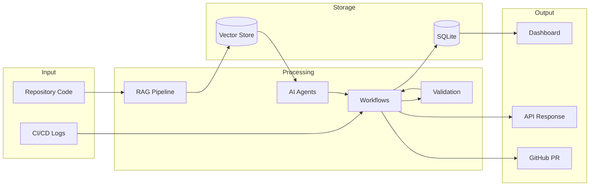
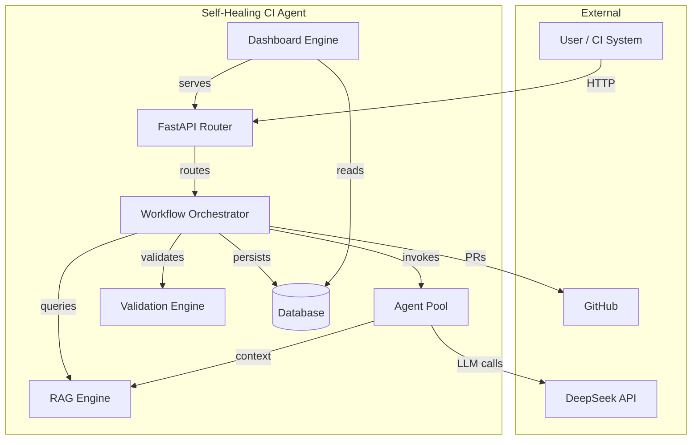
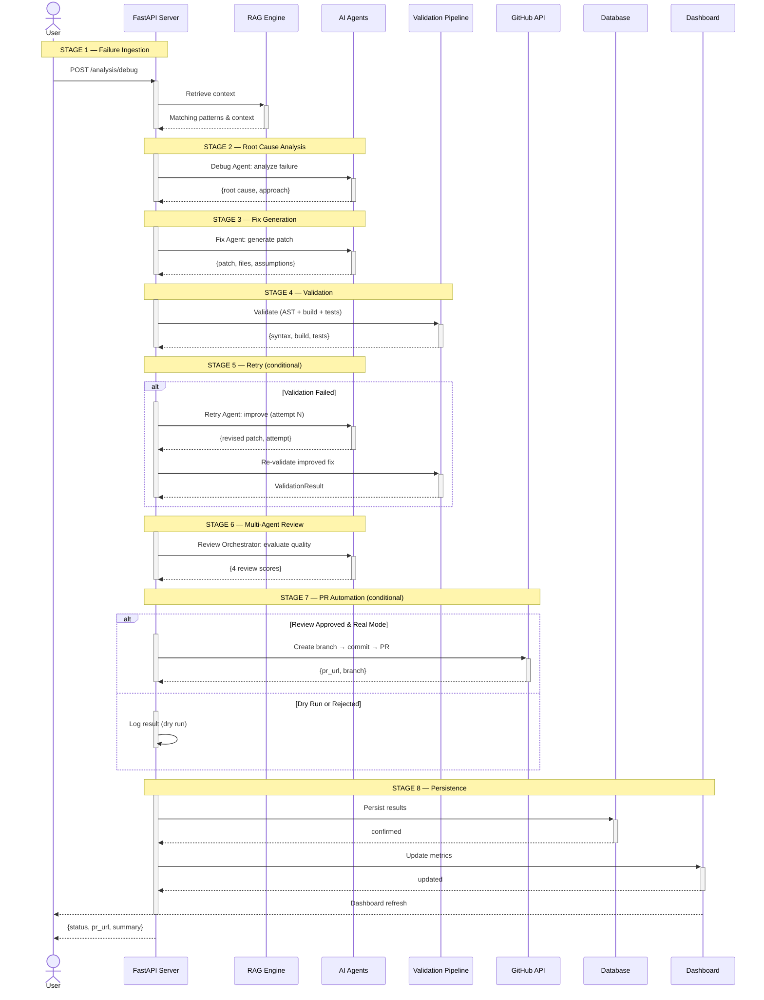

# Architecture

## System Overview

The Self-Healing AI CI/CD Agent is built on a modular, microservices-inspired architecture using FastAPI as the core backend framework. The system is organized into distinct layers that handle specific responsibilities, from data ingestion to workflow orchestration to presentation.

## Layers

### 1. API Layer (`app/api/`)

Entry points for all external interactions. Uses FastAPI routers with clear separation:

- **System Routes** — Health checks and versioning
- **RAG Routes** — Repository indexing and context retrieval
- **Analysis Routes** — CI/CD failure analysis
- **Fix Routes** — AI-powered fix generation
- **Validation Routes** — Multi-stage validation pipeline
- **Retry Routes** — Self-healing retry loop
- **Review Routes** — Multi-agent code review
- **PR Routes** — Pull request automation
- **Dashboard Routes** — Metrics, analytics, and benchmarks

All routes use Pydantic models for request validation and follow consistent error handling patterns.

### 2. Agent Layer (`app/agents/`)

Specialized AI agents, each responsible for a specific task:

- **Debug Agent** — Analyzes CI/CD logs to identify root cause
- **Fix Agent** — Generates code fixes using RAG context
- **Retry Agent** — Implements adaptive retry strategies
- **Review Orchestrator** — Coordinates multi-agent review
- **Security Reviewer** — Scans for security vulnerabilities
- **Performance Reviewer** — Evaluates performance impact
- **Quality Reviewer** — Assesses code quality
- **Coverage Reviewer** — Checks test coverage adequacy

Each agent uses LangChain to interact with the DeepSeek LLM via structured prompt templates.

### 3. RAG Layer (`app/rag/`)

Retrieval-Augmented Generation pipeline for context-aware debugging:

- **Repository Loader** — Clones and loads repositories
- **Chunking** — Splits code into semantically meaningful chunks
- **Embedding** — Generates vector embeddings using Sentence Transformers
- **Vector Store** — FAISS-based vector index for similarity search
- **Retriever** — Queries the vector store for relevant context
- **Indexing Pipeline** — Orchestrates the full indexing workflow

### 4. Validation Layer (`app/validation/`)

Multi-stage validation pipeline:

- **Syntax Validator** — Validates Python syntax using `ast.parse`
- **Build Validator** — Checks project structure, config files, imports
- **Test Runner** — Executes pytest and captures failures
- **Validation Service** — Orchestrates the full validation pipeline

### 5. Workflow Layer (`app/workflows/`)

Orchestration layer that coordinates agents, RAG, validation, and persistence:

- **Analysis Workflow** — Coordinates debug analysis with RAG context
- **Fix Generation Workflow** — Generates and applies fixes
- **Validation Workflow** — Runs full validation pipeline
- **Retry Workflow** — Implements adaptive self-healing loop
- **Review Workflow** — Runs multi-agent review pipeline
- **PR Workflow** — Orchestrates PR creation

### 6. Dashboard Layer (`app/dashboard/`)

Metrics collection, analytics, and reporting:

- **Metrics Collector** — Queries database for workflow metrics
- **Analytics Engine** — Computes success rates, distributions, scores
- **Benchmark Service** — Generates system health benchmarks
- **Report Generator** — Produces structured reports
- **Charts** — Returns chart-ready datasets

### 7. Integration Layer

- **Database (`app/database/`)** — SQLAlchemy models and session management
- **GitHub (`app/github/`)** — GitHub API client, branch/commit/PR management
- **Utilities (`app/utils/`)** — Logger, DeepSeek client, file utils, retry utils
- **Prompts (`app/prompts/`)** — LLM prompt templates for each agent

## Data Flow

## Component Diagram

## End-to-End Workflow Sequence

---

## Technology Stack

| Component | Technology | Purpose |
|-----------|-----------|---------|
| Web Framework | FastAPI 0.115 | Async Python API server |
| AI Framework | LangChain 1.0 | LLM abstraction & chaining |
| LLM | DeepSeek API | AI reasoning & generation |
| Vector Search | FAISS + Sentence Transformers | Semantic code search |
| Database | SQLite + SQLAlchemy | Data persistence |
| Frontend | Streamlit 1.41 | Interactive dashboard |
| Logging | Loguru | Structured logging |
| Container | Docker | Deployment packaging |

## Design Decisions

1. **SQLite for development** — Zero-config database suitable for single-node deployments; PostgreSQL adapter available for production.

2. **FAISS for vector search** — Lightweight, in-process vector store that avoids external service dependencies.

3. **Loguru for logging** — Structured, rotating, colorized logging with minimal configuration.

4. **Pydantic settings** — Type-safe configuration with `.env` file support and sensible defaults.

5. **Workflow-based orchestration** — Each pipeline phase is a discrete workflow module, enabling independent testing and future parallelization.
