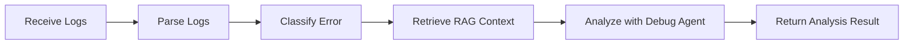
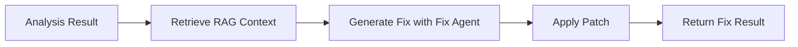
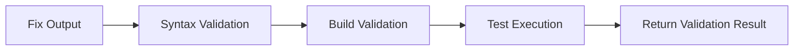
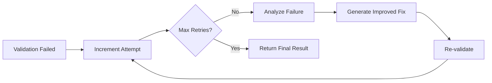
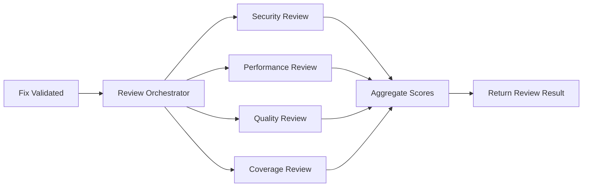
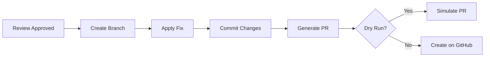
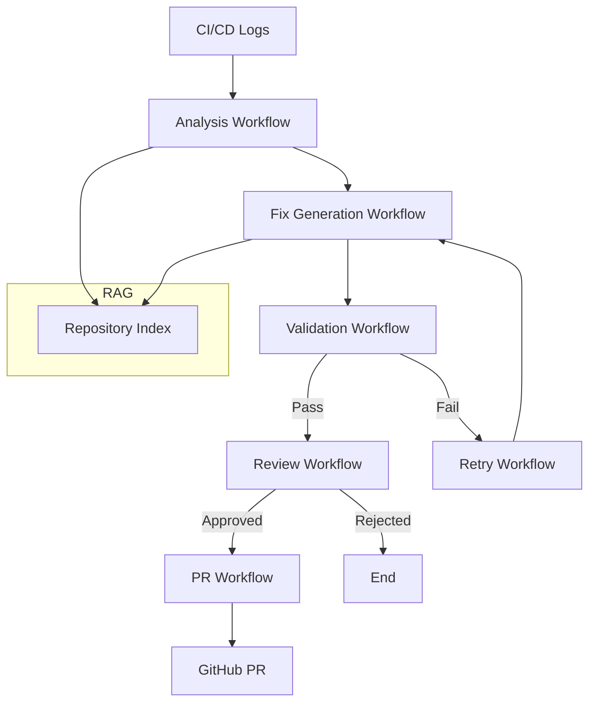

# Workflows

## Overview

The system implements six core workflows, each orchestrating a specific phase of the CI/CD failure resolution pipeline. Workflows are defined in `app/workflows/` and are invoked by the API layer.

---

## 1. Analysis Workflow (`analysis_workflow.py`)

### Purpose
Analyze CI/CD failure logs to identify root cause and relevant context.

### Steps

### Input
- `repository_name`: str — Name of the repository
- `logs`: str — Raw CI/CD failure logs

### Output
- `error_summary`: str — Summarized error description
- `error_category`: str — Classification (e.g., "syntax", "dependency", "test")
- `root_cause`: str — Identified root cause
- `context`: list — Relevant code snippets from RAG
- `suggested_approach`: str — High-level fix strategy

### Implementation
1. Logs are parsed using `log_parser.py`
2. Errors are classified using `error_classifier.py`
3. RAG retrieves relevant code context via `retriever.py`
4. `debug_agent.py` uses LangChain to analyze the failure with DeepSeek

---

## 2. Fix Generation Workflow (`fix_generation_workflow.py`)

### Purpose
Generate targeted code fixes based on analysis results.

### Steps

### Input
- `repository_name`: str — Repository name
- `logs`: str — CI/CD failure logs

### Output
- `fix_summary`: str — Description of the generated fix
- `modified_files`: list — List of files changed
- `patch`: str — Unified diff patch
- `assumptions`: list — Assumptions made during fix generation

### Implementation
1. RAG retrieves relevant code context
2. `fix_agent.py` generates fix using `fix_prompt.py` template
3. `patch_applier.py` creates the patch

---

## 3. Validation Workflow (`validation_workflow.py`)

### Purpose
Validate generated fixes through syntax, build, and test checks.

### Steps

### Input
- `repository_name`: str — Repository name
- `logs`: str — CI/CD logs

### Output
- `syntax_valid`: bool — Syntax check passed
- `build_valid`: bool — Build check passed
- `tests_passed`: int — Number of tests passed
- `tests_failed`: int — Number of tests failed
- `overall_status`: str — "passed", "failed", or "partial"

### Implementation
1. `syntax_validator.py` validates Python syntax with `ast.parse`
2. `build_validator.py` checks project structure and config files
3. `test_runner.py` executes pytest and collects results
4. `validation_service.py` orchestrates the pipeline

---

## 4. Retry Workflow (`retry_workflow.py`)

### Purpose
Implement adaptive self-healing with escalating fix strategies when validation fails.

### Steps

### Input
- `repository_name`: str — Repository name
- `logs`: str — CI/CD logs

### Output
- `attempts`: list — List of retry attempts with details
- `final_status`: str — "resolved" or "unresolved"
- `final_fix`: dict — The final fix if resolved

### Implementation
1. `retry_agent.py` analyzes why validation failed
2. Generates improved fix with additional context
3. Re-runs validation pipeline
4. Configurable via `MAX_RETRIES` and `RETRY_DELAY` settings

---

## 5. Review Workflow (`review_workflow.py`)

### Purpose
Run multi-agent review across security, performance, quality, and coverage dimensions.

### Steps

### Input
- `repository_name`: str — Repository name
- `logs`: str — CI/CD logs

### Output
- `scores`: dict — Per-category scores (0.0–1.0)
- `overall_score`: float — Weighted average score
- `recommendation`: str — "approved", "changes_requested", or "rejected"
- `details`: dict — Detailed feedback from each reviewer

### Implementation
1. `review_orchestrator.py` coordinates 4 specialized reviewers
2. Each reviewer uses a dedicated prompt template
3. Scores are aggregated with configurable weights

---

## 6. PR Workflow (`pr_workflow.py`)

### Purpose
Automate pull request creation for approved fixes.

### Steps

### Input
- `repository_name`: str — Repository name
- `logs`: str — CI/CD logs
- `dry_run`: bool — If True, simulate without creating
- `approved`: bool — Must be True for real PR creation

### Output
- `pr_url`: str — URL of created PR (empty if dry run)
- `branch_name`: str — Branch created for the fix
- `pr_title`: str — Generated PR title
- `pr_description`: str — Generated PR description
- `dry_run`: bool — Whether this was a simulation

### Implementation
1. `branch_manager.py` creates or reuses branches
2. `patch_applier.py` applies the fix to the branch
3. `commit_manager.py` creates commits
4. `pr_generator.py` generates PR title and description
5. `pr_service.py` orchestrates the full process

---

## Workflow Dependencies

## Configuration

Workflow behavior is controlled via environment variables:

| Variable | Default | Description |
|----------|---------|-------------|
| `MAX_RETRIES` | 3 | Maximum retry attempts |
| `RETRY_DELAY` | 1.0 | Delay between retries (seconds) |
| `MAX_RETRY_ATTEMPTS` | 3 | Max self-healing iterations |
| `CHUNK_SIZE` | 512 | RAG chunk size |
| `CHUNK_OVERLAP` | 50 | RAG chunk overlap |
